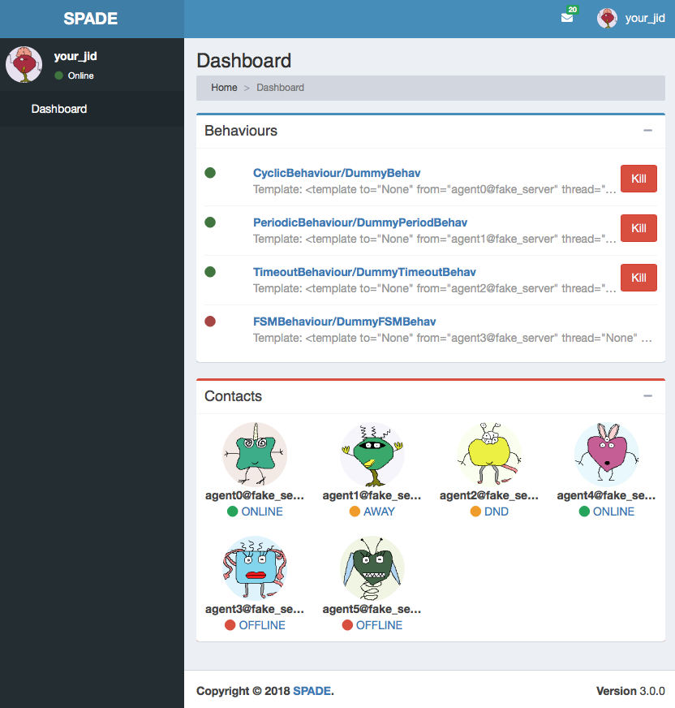
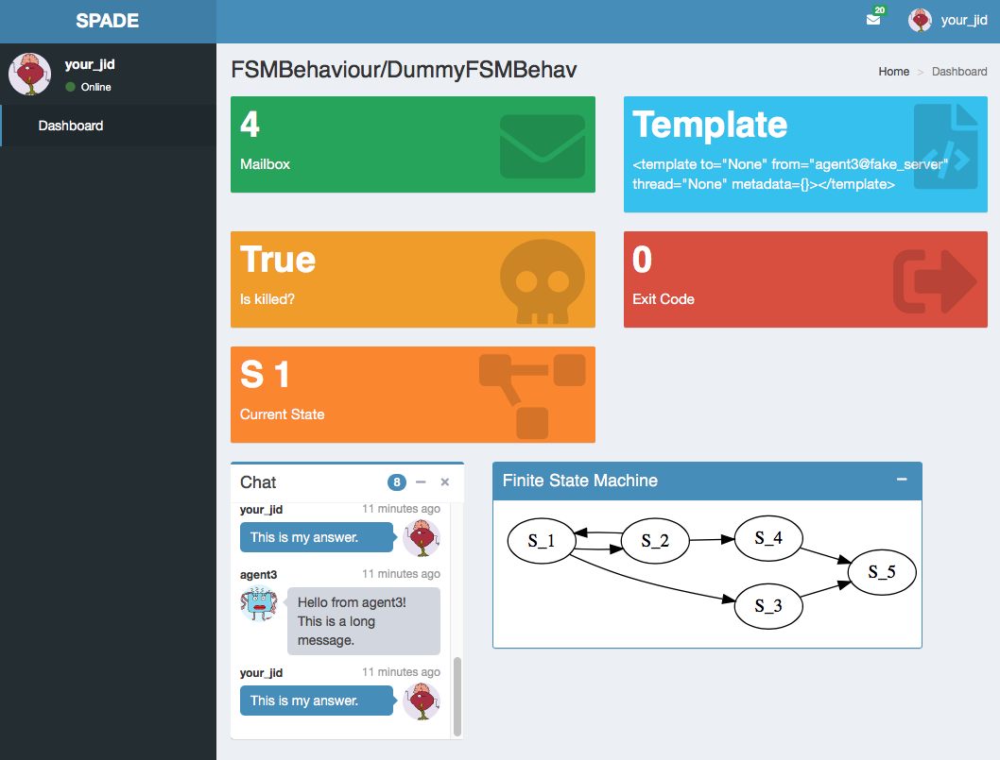
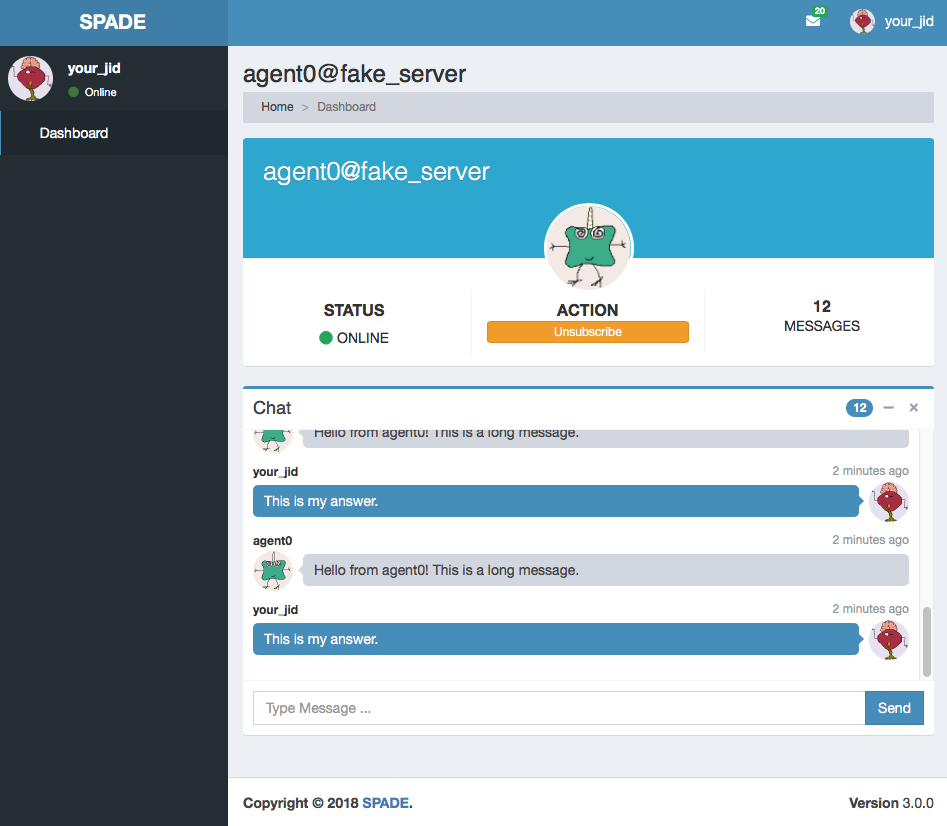

=======================
Web Graphical Interface
=======================

Each agent in SPADE provides a graphical interface *by default* that is accesible via web under the ``/spade`` path.
To activate the web interface you just have to start the web module of the agent just as follows::

    agent = MyAgent("your_jid@your_xmpp_server", "your_password")
    agent.start()
    agent.web.start(hostname="127.0.0.1", port="10000")

Then you can open a web browser and go to the url ``http://127.0.0.1:10000/spade`` and you'll see the
main page of your agent:

.. warning:: Remember to change the example's jids and passwords by your own accounts. These accounts do not exist
    and are only for demonstration purposes.

In the previous image you can see the index page of an agent, where you can check its name and avatar,
a list of its behaviours, and a list of its contacts. In the top menu bar you can also check its
incoming messages and the profile menu of the agent where you can stop the agent.

.. caution:: Note that if you run several agents with the web interface each agent **should** have a different port in
    order to avoid errors because some port is busy. The hostname can also be customized if you need to expose only to
    ``localhost`` or to a public ip (or even ``0.0.0.0``).

In the behaviours box you can see all the behaviours that have been added to the agent, both the
active ones and the ended ones. You can click the **kill** button to stop a behaviour and you can
click the behaviour's name to see more information about it as in the next image:

In this page you can check some important information about the behaviour such as its mailbox, the template with which
it was registered, wether if it is killed or not or its exit code. Also, each type of behaviour may show any information
related with its internal data, e.g. in the previous image you can see that the behaviour is an FSMBehaviour and the
interface shows the current state where the FSM is and an image with the structure of the FSM.
Finally, you can also check all the messages that have been sent or received from/to this behaviour in the chat box.

.. note:: To see more information about a message just click on the message text and you'll see something like the next
    image:

    .. image:: images/spade_msg.png
      :alt: SPADE message detail
      :width: 50%
      :align: center

From the index page you can also click on any of your contacts to see information about them. In a contact's page you
can check the presence status of your contact, unsubscribe from it and check the messages exchanged with it in the chat
box. In such chat box you can also send a message to the contact.

Creating custom web interfaces
==============================

SPADE web module can also be used to create your own applications served by your agents themselves. You can register new
paths in the web module and, following the model-view-controller paradigm (MVC), register controllers that compute the
necessary data from the agent (the model) and render a template (the view) which will be served when someone requests
the path with which it was registered. Let's see an example::

    async def hello_controller(request):
        return {"number": 42}

    a = Agent("your_jid@your_xmpp_server", "your_password")

    a.web.add_get("/hello", hello_controller, "hello.html")

    a.start(auto_register=True)
    a.web.start(port=10000)

In this example there are some elements that must be explained:

    #. The ``hello_controller`` function is a coroutine (see the ``async`` statement) that returns a dictionary with data that will be rendered in the template.
    #. The ``add_get`` method allows us to register a new controller with a path and a template.
    #. You can alternatively use the ``add_post`` method if the http request must be of type **POST** (e.g. sending forms).

Next we are going to explain a little more about the controller, the path and the template.

.. note:: Please, do not use the ``/spade`` path o avoid conflicts with the default agent pages (unless you want to modify them).

Controller
----------
The controller is the asyncronous method (or coroutine) that prepares the data to render the web page. It is an ``async``
method that always receives a single argument: ``request``. A controller queries the
model, which in our case is the agent (accesible in your coroutines using ``self.agent``) and prepares a dictionary
which will be used to render the template (as we will see in a moment). Inside a controller coroutine you can do
any agent related stuff (sending messages, starting or killing behaviours, etc.).

.. hint:: Just remember the trick that a coroutine should not be too intensive in cpu, to avoid blocking the execution of the agent.

An example of controller would be::

    async def my_behaviours_controller(request):
        behaviours_list = []
        for b in self.agent.behaviours:
            behaviours_list.append(str(b))

        return {
                 "behaviours": behaviours_list,
                 "rand": random.random()
                }

This controller would pass a variable called "behaviours" with the names of all the agent's behaviours to the template,
which would be able to render such data. It also generates a random number which is stored in the "rand" key of the data
passed to the template.

In the case that your controller responds to a **POST** query (it has been registered with the ``add_post`` method) you
can recover the data sent through the request by using this snippet of code::

    async def my_post_controller(request):
        form = await request.post()

Following the last example, the *form* variable would be a dictionary containing the data sent from the client. This way
you can create forms in your web applications to be sent to your agents.

.. hint:: Instead of returning a dict with data to be rendered you can redirect to another URL by raising an ``HTTPFound``
          exception from the ``aiohttp.web`` module as in the next example::

              from aiohttp import web

              async def my_redirect_controller(request):
                  raise web.HTTPFound("/")

JSON Responses
^^^^^^^^^^^^^^

In the case that you need to return a JSON Response instead of an HTML page, is as simple as follows: call the
``add_get`` or ``add_post`` method passing ``None`` as the template argument. Thus, the dictionary that you are
returning in your controller coroutine will be built into a JSON Response instead of rendering a jinja2 template.

Example::

    async def json_controller(self, request):
        return {"my_data": {'a': 0, 'b': 1, 'c': 2}}

    self.web.add_get("/home", self.json_controller, template=None)

.. hint:: You may also use the ``raw=True`` parameter in the ``add_get`` and ``add_post`` methods to indicate that the
    returned result should not be processed neither by jinja2 nor json parsing.

Path
----
The path will define where your application will respond to requests. You can use any allowed character for defining
paths. To define variable paths you can also use the
`aiohttp syntax <https://aiohttp.readthedocs.io/en/stable/web_quickstart.html#variable-resources>`_.
For example, a path ``/a/{agentjid}/c`` would match with the url ``/a/agent@server/c``. Then, in your controller, you
can recover the ``agentjid`` value using the request object::

    async def my_controller(request):
        jid = request.match_info['agentjid']
        return {"jid": jid}

Template
--------

The template is an HTML file with an specific format which allows you to prepare dynamic web pages that are rendered with
the information generated by your agent. The SPADE templates are created in the `Jinja2 <http://jinja.pocoo.org>`_
format, which allows the rendering process to have variables that come from our agent controllers and control structures.

In Jinja 2 variables are wrapped with double curly brackets (e.g. ``{{ my_variable }}``) and the control structures with
curly brackets and the percentage symbol (e.g. `` Hello World ``).

.. note:: To know more about the Jinja 2 template engine please visit: http://jinja.pocoo.org/docs/

.. hint::
    To allow SPADE to find your templates you can use the ``templates_path`` argument when starting the web module::

        agent.web.start(port=10000, templates_path="static/templates")

A simple example of template would be:

.. code-block:: html

    <html>
      <head>
        <title>{{ agent.jid }}</title>
      </head>
      <body>
         My favourite number is {{ number }}
         <h2>My behaviours:</h2>
         <ol>
         
             <li> {{ b }} </li>
         
         </ol>
      </body>
    </html>

.. note:: Note that the ``agent`` variable is always available in your templates to help you to access your internal data.
