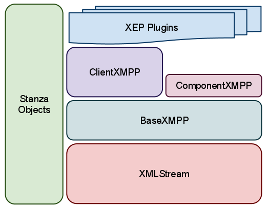

.. index:: XMLStream, BaseXMPP, ClientXMPP, ComponentXMPP

Slixmpp Architecture
======================

The core of Slixmpp is contained in four classes: ``XMLStream``,
``BaseXMPP``, ``ClientXMPP``, and ``ComponentXMPP``. Along side this
stack is a library for working with XML objects that eliminates most
of the tedium of creating/manipulating XML.

.. index:: XMLStream

The Foundation: XMLStream
-------------------------
:class:`~slixmpp.xmlstream.xmlstream.XMLStream` is a mostly XMPP-agnostic
class whose purpose is to read and write from a bi-directional XML stream.
It also allows for callback functions to execute when XML matching given
patterns is received; these callbacks are also referred to as :term:`stream
handlers <stream handler>`. The class also provides a basic eventing system
which can be triggered either manually or on a timed schedule.

The event loop
~~~~~~~~~~~~~~
:class:`~slixmpp.xmlstream.xmlstream.XMLStream` instances inherit the
:class:`asyncio.BaseProtocol` class, and therefore do not have to handle
reads and writes directly, but receive data through
:meth:`~slixmpp.xmlstream.xmlstream.XMLStream.data_received` and write
data in the socket transport.

Upon receiving data, :term:`stream handlers <stream handler>` are run
immediately, except if they are coroutines, in which case they are
scheduled using :meth:`asyncio.async`.

:term:`Event handlers <event handler>` (which are called inside
:term:`stream handlers <stream handler>`) work the same way.

How XML Text is Turned into Action
~~~~~~~~~~~~~~~~~~~~~~~~~~~~~~~~~~
To demonstrate the flow of information, let's consider what happens
when this bit of XML is received (with an assumed namespace of
``jabber:client``):

.. code-block:: xml

    <message to="user@example.com" from="friend@example.net">
      <body>Hej!</body>
    </message>

#. **Convert XML strings into objects.**

   Incoming text is parsed and converted into XML objects (using
   ElementTree) which are then wrapped into what are referred to as
   :term:`Stanza objects <stanza object>`. The appropriate class for the
   new object is determined using a map of namespaced element names to
   classes.

   Our incoming XML is thus turned into a :class:`~slixmpp.stanza.Message`
   :term:`stanza object` because the namespaced element name
   ``{jabber:client}message`` is associated with the class
   :class:`~slixmpp.stanza.Message`.

#. **Match stanza objects to callbacks.**

   These objects are then compared against the stored patterns associated
   with the registered callback handlers.

   Each handler matching our :term:`stanza object` is then added to a list.

#. **Processing callbacks**

   Every handler in the list is then called with the :term:`stanza object`
   as a parameter; if the handler is a
   :class:`~slixmpp.xmlstream.handler.CoroutineCallback`
   then it will be scheduled in the event loop using :meth:`asyncio.async`
   instead of run.

#. **Raise Custom Events**

   Since a :term:`stream handler` shouldn't block, if extensive processing
   for a stanza is required (such as needing to send and receive an
   :class:`~slixmpp.stanza.Iq` stanza), then custom events must be used.
   These events are not explicitly tied to the incoming XML stream and may
   be raised at any time.

   In contrast to :term:`stream handlers <stream handler>`, these functions
   are referred to as :term:`event handlers <event handler>`.

   The code for :meth:`BaseXMPP._handle_message` follows this pattern, and
   raises a ``'message'`` event

   .. code-block:: python

        self.event('message', msg)

#. **Process Custom Events**

   The :term:`event handlers <event handler>` are then executed, passing
   the stanza as the only argument.

   .. note::
       Events may be raised without needing :term:`stanza objects <stanza object>`.
       For example, you could use ``self.event('custom', {'a': 'b'})``.
       You don't even need any arguments: ``self.event('no_parameters')``.
       However, every event handler MUST accept at least one argument.

   Finally, after a long trek, our message is handed off to the user's
   custom handler in order to do awesome stuff::

       reply = msg.reply()
       reply['body'] = "Hey! This is awesome!"
       reply.send()

.. index:: BaseXMPP, XMLStream

Raising XMPP Awareness: BaseXMPP
--------------------------------
While :class:`~slixmpp.xmlstream.xmlstream.XMLStream` attempts to shy away
from anything too XMPP specific, :class:`~slixmpp.basexmpp.BaseXMPP`'s
sole purpose is to provide foundational support for sending and receiving
XMPP stanzas. This support includes registering the basic message,
presence, and iq stanzas, methods for creating and sending stanzas, and
default handlers for incoming messages and keeping track of presence
notifications.

The plugin system for adding new XEP support is also maintained by
:class:`~slixmpp.basexmpp.BaseXMPP`.

.. index:: ClientXMPP, BaseXMPP

ClientXMPP
----------
:class:`~slixmpp.clientxmpp.ClientXMPP` extends
:class:`~slixmpp.clientxmpp.BaseXMPP` with additional logic for connecting
to an XMPP server by performing DNS lookups. It also adds support for stream
features such as STARTTLS and SASL.

.. index:: ComponentXMPP, BaseXMPP

ComponentXMPP
-------------
:class:`~slixmpp.componentxmpp.ComponentXMPP` is only a thin layer on top of
:class:`~slixmpp.basexmpp.BaseXMPP` that implements the component handshake
protocol.
